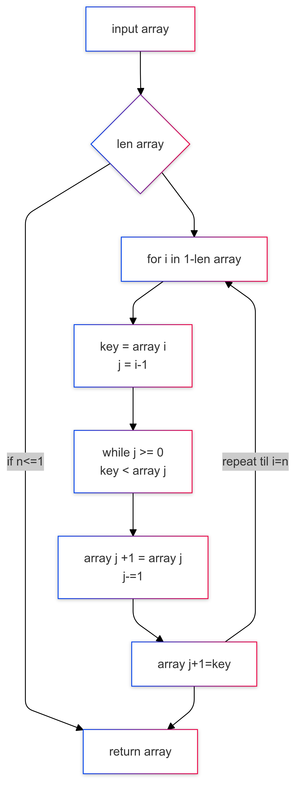

# Handout zur Präsentation: **Sortieralgorithmen mit Python**

## **Projektarbeit Python Sortieralgorithmen**
**Gruppe:** Jamil – Manuel – Daniel  
**Kurs:** TIP/TIA-24-A-a  

---

### **Ablauf der Präsentation**
1. Einführung in den Sortieralgorithmus
2. InsertionSort Algorithmus
3. User-Input und Ausgabe
4. Demo: Sortierte Zahlen
5. Unit Testing
6. Automatisches Testing (GitHub-Pipeline)
7. Git Commits und Zusammenarbeit
8. Schluss und Diskussion

---

## **1. Sortieralgorithmus – Einführung**
Sortieralgorithmen sind wichtige Bestandteile der Informatik. Sie optimieren Datenstrukturen für effiziente Speicherung und Verarbeitung.

- **Beispielanwendung:** Ordnung von Zahlen, Namen oder komplexen Datensätzen.

---

## **2. InsertionSort Algorithmus**
- **Funktionsweise:**
  - Elemente werden eines nach dem anderen in die richtige Position eingefügt.
  - Vergleichsbasierter Algorithmus mit einfacher Logik.
- **Vorteile:**
  - Einfach zu implementieren.
  - Effizient für kleine Datensätze.
- **Nachteile:**
  - Langsam bei großen Datensätzen.
- **Flowchart:**

---

## **3. User-Input und Ausgabe**
- **Input:** Der Benutzer gibt eine unsortierte Liste von Zahlen ein.
- **Output:** Die Liste wird nach dem InsertionSort-Algorithmus sortiert und ausgegeben.

---

## **4. Demo: Sortierte Zahlen**
Live-Demonstration des Algorithmus:
- Eingabe: `[34, 12, 25, 9, 1]`
- Ausgabe: `[1, 9, 12, 25, 34]`

---

## **5. Unit Testing**
- **Definition:** Einzelne Komponenten des Programms werden isoliert getestet.
- **Ziel:** Sicherstellen, dass jede Funktion korrekt arbeitet.
- **Beispieltest:**
  - Eingabe: `[3, 1, 2]`
  - Erwartete Ausgabe: `[1, 2, 3]`

---

## **6. Automatisches Testing**
- **Pipeline:** Automatische Tests werden bei jedem GitHub-Push oder -Pull ausgeführt.
- **Vorteile:**
  - Frühzeitige Fehlererkennung.
  - Erhöhte Code-Qualität.

---

## **7. Git Commits und Zusammenarbeit**
- **Arbeitsweise:**
  - Regelmäßige Commits zur Dokumentation der Fortschritte.
  - Zusammenarbeit über GitHub: Pull Requests, Code Reviews.
- **Best Practices:**
  - Aussagekräftige Commit-Botschaften.
  - Branch-Strategien (z. B. `main`, `feature/*`).

---

## **8. Schluss und Diskussion**
- **Zusammenfassung:**
  - InsertionSort eignet sich für kleine Datensätze und zur Veranschaulichung von Sortieralgorithmen.
  - Unit Testing und automatisches Testing verbessern die Code-Qualität nachhaltig.
